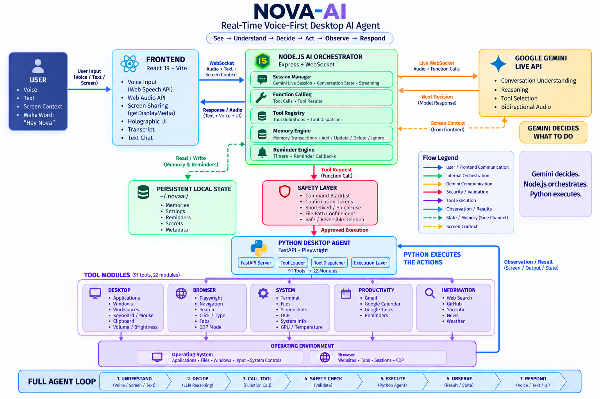

# Nova-AI — AI Voice Assistant with Holographic Interface

A real-time, voice-to-voice holographic AI companion desktop assistant built on the **Google Gemini Live API**. Nova-AI combines a holographic video character, persistent memory, a reminder system, a full desktop automation agent, and an in-app browser — all running locally with a 3-process architecture.

---

## Table of Contents

- [Architecture Overview](#architecture-overview)
- [Tech Stack](#tech-stack)
- [Project Structure](#project-structure)
- [How It Works](#how-it-works)
- [Database / Persistence](#database--persistence)
- [AI Integration](#ai-integration)
- [Function Calling Tools](#function-calling-tools)
- [Desktop Agent (Python)](#desktop-agent-python)
- [Frontend](#frontend)
- [Authentication & API Keys](#authentication--api-keys)
- [Security Model](#security-model)
- [Configuration](#configuration)
- [Running the Project](#running-the-project)
- [Environment Variables](#environment-variables)
- [Themes](#themes)

---

## Architecture Overview

<div align="center">

| Architecture diagram |
|----------------------|
|  

</div>

---

Nova-AI runs as **3 separate processes** that communicate over HTTP/WebSocket:

```
┌─────────────────────────────────────────────────────┐
│                  BROWSER (React)                    │
│   Holographic UI · Settings · Memory · Transcript   │
│         WebSocket (Gemini Live) ←→ Node.js          │
│              HTTP ←→ Desktop Agent (Python)          │
└─────────────────────────────────────────────────────┘
         │                          │
         ▼                          ▼
┌─────────────────┐     ┌──────────────────────┐
│   Node.js Server │     │  Python Desktop Agent │
│   Port 3000      │     │  Port 8765            │
│                  │     │                       │
│  Express + WS    │     │  FastAPI + Playwright  │
│  Gemini Live API │     │  OS-level tools        │
│  Memory/Reminder │     │  Browser automation    │
│  Function calling│     │  File system, System   │
└─────────────────┘     └──────────────────────┘

```

--- 

| Process | Port | Runtime | Role |
|---|---|---|---|
| **Node.js Server** | 3000 | Express + WebSocket | Orchestrator. Bridges browser to Gemini Live API. Handles function calling, memory CRUD, reminders, settings, API key storage. |
| **Python Desktop Agent** | 8765 | FastAPI + Playwright | OS-level tool execution. 91 tools across 22 modules. Receives `POST /execute { tool, args }` dispatches. Manages browser (CDP/managed modes), screenshots, clipboard, files, power, terminal, Hyprland workspaces, weather, news, coding, conversation export, Google Calendar/Gmail/Tasks, OS input simulation. |
| **Vite React Frontend** | 3000 (served) | React 19 + Tailwind CSS v4 | Holographic UI with canvas visualizer, video character or orb animation, settings panel, memory dashboard, transcript, browser agent, text chat fallback, sudo popup. |

---

## Tech Stack

### Frontend
- **React 19** + **TypeScript**
- **Tailwind CSS v4** (via `@tailwindcss/vite` plugin)
- **Motion** (animation library)
- **Vite** (build tool + dev server)
- Google Fonts: Space Grotesk, Inter, JetBrains Mono
- Canvas API — custom holographic visualizer with particle rings, plasma core, emotion glow
- Web Speech API — wake word detection ("Hey Nova")
- Web Audio API — PCM audio encoding/decoding for Gemini Live (16-bit, 16kHz)
- `getDisplayMedia` — screen sharing to Gemini

--- 


### Backend (Node.js)
- **Express** HTTP server
- **ws** WebSocket library for Gemini Live API streaming
- **@google/genai** SDK for Gemini function calling
- **esbuild** for server bundling
- Optional: **Electron** for desktop wrapper

--- 


### Backend (Python Desktop Agent)
- **FastAPI** + **Uvicorn**
- **Playwright** (async browser automation, dedicated event loop in a thread)
- **psutil** (system monitoring)
- **pyautogui** / **pywin32** (Windows automation)
- **pyperclip** (clipboard)
- **pytesseract** + **Pillow** (OCR / screenshots)
- **pycaw** (Windows audio)
- **Send2Trash** (safe file deletion)
- **nvidia-ml-py3** (NVIDIA GPU stats)

--- 


### Platform Abstraction
The Python agent has a backend abstraction layer for cross-platform support:
- `agent/backends/base.py` — abstract interfaces (`WindowManager`, `AudioController`, `ClipboardManager`, `TerminalController`, `Launcher`, `ScreenshotController`)
- `agent/backends/factory.py` — OS detection + backend instantiation
- `agent/backends/windows.py` — Win32 API (win32gui, ctypes)
- `agent/backends/linux_wayland.py` — Hyprland/Wayland (hyprctl, grim, wpctl)
- `agent/backends/linux_gnome.py` — GNOME/X11 (wmctrl, xdotool, xclip)
- `agent/backends/macos.py` — macOS (osascript, AppleScript)

---

## Project Structure

```
nova-ai-ai-assistant/
├── server.ts                  # Main Node.js server (Express + WebSocket + Gemini Live)
├── server_memory.ts           # Memory CRUD API (REST endpoints)
├── server_reminders.ts        # Reminder system (timer-based with notification injection)
├── server_paths.ts            # Data directory path resolution
├── local-agent.js             # Standalone Playwright server (port 3001)
├── run_agent.py               # PyInstaller entry point for standalone agent
├── start_nova-ai.sh             # Launch script (Python agent + Node server)
│
├── package.json
├── tsconfig.json
├── vite.config.ts
├── index.html
├── .env                       # Environment variables (GEMINI_API_KEY, etc.)
├── .env.local                 # Environment template (no secrets)
│
├── assets/
│   └── NOVA-AI_Workflow.png
├── public/
│   └── assets/
│       ├── idle.mp4 / idle.webm       # Character video — idle state
│       ├── thinking.mp4 / thinking.webm # Character video — thinking state
│       ├── talking.mp4 / talking.webm  # Character video — talking state
│       ├── orb2.gif                   # Orb animation (alternative to character video)
│       ├── bg-6.mp4 / bg-7.mp4        # Background ambient videos
│       └── download.gif / download_static.png # Legacy orb assets
│
├── src/
│   ├── main.tsx               # React entry point
│   ├── App.tsx                # Main app component (session management, state)
│   ├── index.css              # Tailwind imports + global styles
│   │
│   ├── lib/
│   │   ├── audio.ts           # PCM audio encoding/decoding for Gemini Live
│   │   ├── memoryTypes.ts     # Memory TypeScript interfaces
│   │   ├── reminderTypes.ts   # Reminder TypeScript interfaces
│   │   ├── settingsStore.ts   # Settings persistence (localStorage + server)
│   │   └── wakeWord.ts        # "Hey Nova" wake word detection via Web Speech API
│   │
│   └── components/
│       ├── ApiKeyGate.tsx          # First-run API key onboarding overlay
│       ├── Nova-AICoreVisualizer.tsx # Canvas-based holographic visualizer + video character
│       ├── BrowserAgent.tsx        # In-app browser with tabs, address bar, Playwright backend
│       ├── MemoryDashboard.tsx     # Memory CRUD with category filtering
│       ├── SettingsPanel.tsx       # General, Voice, System, About settings tabs
│       ├── TranscriptPanel.tsx     # Conversation transcript with search/filter
│       ├── SudoPopup.tsx           # Dangerous action confirmation dialog with countdown
│       ├── TextChatFallback.tsx    # Text input alternative when microphone fails
│       ├── Toast.tsx               # Toast notification system for reminders
│       └── HolographicProjector.tsx # Simple iframe-based web projector overlay
│
└── agent/                    # Python agent (FastAPI + Playwright)
    ├── __init__.py
    ├── server.py              # FastAPI app setup, tool registry, /execute dispatcher
    ├── registry.py            # Tool registration system
    ├── requirements.txt       # Python dependencies
    ├── README.md              # Desktop agent documentation
    │
    ├── backends/
    │   ├── __init__.py
    │   ├── base.py            # Abstract backend interfaces
    │   ├── factory.py         # OS detection + backend instantiation
    │   ├── windows.py         # Windows backend (Win32 API)
    │   └── linux_wayland.py   # Linux/Wayland backend (Hyprland)
    │
    └── tools/                 # 22 tool modules
        ├── applications.py   # openApplication, closeApplication (15+ apps)
        ├── browser.py        # desktopBrowser* (16 tools, CDP/managed modes)
        ├── clipboard.py      # copy/paste/get/clear clipboard
        ├── coding.py         # createPythonFile, writeCodeFile, runPythonScript
        ├── confirmation.py   # requestPowerAction, requestTerminalAction (2-step token + blacklist)
        ├── conversation.py   # exportConversation, listExports (save chat history)
        ├── files.py          # create/read/rename/delete/move/open/list/search files
        ├── google.py         # getCalendarEvents, createCalendarEvent, sendEmail, getEmails, getTasks, createTask
        ├── hyprland.py       # switchWorkspace, listWorkspaces (Hyprland/Wayland only)
        ├── iitm.py           # IITM BS Degree portal quick links
        ├── news.py           # getNews (6 categories via Google News RSS)
        ├── os_input.py       # osType, osPress, osClick (keyboard/mouse simulation)
        ├── pc.py             # volume/brightness/power/shutdown controls
        ├── screenshot.py     # take/save/analyze screenshots, readScreen (OCR)
        ├── search.py         # searchWeb, searchYouTube, searchGoogle, searchGitHub
        ├── startup.py        # enable/disable auto-start (Windows registry)
        ├── system.py         # systemInfo, gpuInfo, temperatureInfo
        ├── terminal.py       # runTerminalCommand (with command blacklist + sudo)
        ├── weather.py        # getWeather (via wttr.in)
        ├── websites.py       # openWebsite (25+ named shortcuts)
        └── windows.py        # minimize/maximize/close/switch windows
```

---

## How It Works

### Voice Flow
1. User speaks into microphone (or types in text fallback)
2. Audio is PCM-encoded (16-bit, 16kHz) and sent via WebSocket to Gemini Live API
3. Gemini processes audio in real-time and streams back audio response
4. Audio is decoded and played through the speaker
5. After each conversation turn, Gemini analyzes recent messages and extracts **memory transactions** (add/update/delete facts about the user)

### Wake Word Detection
- Uses the Web Speech API to listen for "Hey Nova"
- When detected, the visualizer transitions to listening state and captures speech

### Function Calling
- Gemini can invoke ~130 server-side tools during conversation across 21 modules + server-native handlers
- Tools are dispatched via `POST /execute` to the Python Desktop Agent (port 8765)
- Terminal commands and power actions use a **two-step token confirmation** system
- Blacklisted commands (`rm -rf`, `:(){:|:&};:`, etc.) are blocked at the token generation step — the AI **never** asks the user to confirm
- File operations are confined to safe directories (Home, Desktop, Documents, etc.)
- Browser automation supports two modes:
  - **Managed mode** (default): Playwright launches its own headed Chromium — works out of the box
  - **CDP mode**: Connects to the user's existing Chrome via `--remote-debugging-port=9222` — preserves cookies/logins

### Holographic Character / Orb
- Two visual styles:
  - **Character mode**: Three MP4/WebM video states (idle, thinking, talking) with canvas-based holographic effects
  - **Orb mode**: Animated GIF orb (e.g., `orb2.gif`) with state-driven scale/opacity transitions
- Canvas renders particle rings, plasma core, emotion glow, scanlines, and mouse-tracking parallax
- GPU acceleration via `translateZ(0)` and contrast/brightness/saturation CSS filters

---

## Database / Persistence

Nova-AI uses **no traditional database**. All data is stored as JSON files in the data directory (`~/.nova-ai/` by default, configurable via `Nova-AI_DATA_DIR`):

| File | Purpose |
|---|---|
| `secrets.json` | API keys (GEMINI_API_KEY, etc.) — never sent to frontend after setup |
| `settings.json` | User preferences (voice, wake word, sensitivity, theme, volumes) |
| `memories.json` | Persistent memory store with categories |
| `reminders.json` | Timer-based reminders |
| `metadata.json` | Project metadata |

### Memory System

Memories are categorized into 7 types:
- **identity** — who the user is (name, role, background)
- **preference** — likes, dislikes, habits
- **goal** — what the user is working toward
- **project** — specific projects and their status
- **relationship** — people in the user's life
- **emotional** — mood patterns, emotional state
- **behavior** — behavioral patterns and routines

After each conversation turn, Gemini analyzes a slice of recent messages and produces memory transactions (add/update/delete/ignore). Users can also manage memories manually via the Memory Dashboard.

### Reminder System
- Timer-based using `setInterval` with configurable delay and optional repeat
- Fires browser toast notifications with countdown
- Injects a callback into the active Gemini session so Nova-AI can remind you verbally

---

## AI Integration

### Gemini Live API
- Real-time bidirectional audio streaming via WebSocket
- 16-bit PCM audio at 16kHz sample rate
- Configurable voice (7 options): Aoede, Charon, Fenrir, Kore, Leda, Puck, Zephyr
- System prompt establishes Nova-AI's personality and context

### Function Calling (Server-Side Tools)

Nova-AI registers **~113 function declarations** with Gemini, spanning:

| Category | Example Tools |
|---|---|
| **Browser** | `browserOpen`, `browserSearch`, `browserClick`, `browserType`, `browserMediaControl`, `browserTabAction`, `browserScroll`, `browserGoBack` |
| **Desktop Browser** | `desktopBrowserOpen`, `desktopBrowserSearch`, `desktopBrowserClick`, `desktopBrowserType`, `desktopBrowserFillForm`, `desktopBrowserGetLinks`, `desktopBrowserReadText`, `desktopBrowserScroll`, `desktopBrowserGoBack/Forward`, `desktopBrowserOpenTab/CloseTab` |
| **System** | `setUserVolume`, `setAssistantVolume`, `setReminder`, `listReminders`, `cancelReminder`, `changeBackground`, `changeVoice` |
| **OS Input** | `osType`, `osPress`, `osClick` |
| **Memory** | `saveCustomMemory` |
| **Desktop Agent** | All 88 Python tools are proxied through Gemini via `server.ts` — see [Desktop Agent section](#desktop-agent-python) for the full list. |

All tools dispatch to either the Python desktop agent (port 8765) or handle directly in Node.js (memory, reminders, background, voice).

---

## Desktop Agent (Python)

The Python desktop agent runs on port 8765 and provides **91 tools** across 22 modules:

### Tool Modules

| Module | Tools | Description |
|---|---|---|
| `applications` | `openApplication`, `closeApplication` | Launch/close 15+ pre-configured apps (Chrome, VS Code, Spotify, Discord, etc.) with Windows/Linux path mappings |
| `browser` | 16 browser tools | Full Playwright browser automation (CDP + managed modes): navigate, click, type, fill forms, scroll, read text, get links, tab management, media control, set mode |
| `clipboard` | `copySelected`, `pasteClipboard`, `getClipboard`, `clearClipboard` | System clipboard operations |
| `coding` | `createPythonFile`, `writeCodeFile`, `createProjectFolder`, `runPythonScript` | Code file creation (30+ language extensions) and Python execution |
| `confirmation` | `requestPowerAction`, `requestTerminalAction` | Two-step token-based confirmation for dangerous actions (60-second single-use tokens). Blacklist checked BEFORE token generation. |
| `conversation` | `exportConversation`, `listExports` | Save chat history to `data/conversations/` as JSON or text |
| `files` | `createFile`, `readFile`, `renameFile`, `deleteFile`, `moveFile`, `openFolder`, `listFiles`, `searchFiles` | Full file system operations with path confinement to safe directories |
| `google` | `getCalendarEvents`, `createCalendarEvent`, `sendEmail`, `getEmails`, `getTasks`, `createTask` | Google Calendar, Gmail, and Tasks via OAuth 2.0 |
| `hyprland` | `switchWorkspace`, `listWorkspaces`, `moveToWorkspace` | Hyprland (Wayland) workspace management via `hyprctl` |
| `iitm` | `iitmQuickLinks`, `iitmOpen`, `iitmOpenCustom` | IITM BS Degree portal shortcuts |
| `news` | `getNews` | Fetch top headlines across 6 categories via Google News RSS |
| `os_input` | `osType`, `osPress`, `osClick` | OS-level keyboard and mouse simulation |
| `pc` | `volumeUp/Down`, `setVolume`, `brightnessUp/Down`, `setBrightness`, `muteToggle`, `executePowerAction`, `shutdownNova-AI` | System hardware controls |
| `screenshot` | `takeScreenshot`, `saveScreenshot`, `analyzeScreenshot`, `readScreen` | Screenshot capture + Tesseract OCR |
| `search` | `searchWeb`, `searchYouTube`, `searchGoogle`, `searchGitHub` | Web search shortcuts |
| `startup` | `enableAutoStart`, `disableAutoStart`, `getAutoStartStatus` | Auto-start on login (Windows registry) |
| `system` | `systemInfo`, `gpuInfo`, `temperatureInfo` | CPU, RAM, disk, GPU, temperature monitoring |
| `terminal` | `runTerminalCommand`, `provideSudoPassword`, `isCommandAllowed`, `installPackage` | Terminal execution with command blacklist + interactive sudo flow |
| `weather` | `getWeather` | Current weather, feels-like, humidity, wind via `wttr.in` |
| `websites` | `openWebsite` | 25+ named website shortcuts (YouTube, Gmail, GitHub, Reddit, etc.) |
| `windows` | `minimizeWindow`, `maximizeWindow`, `closeWindow`, `switchApplication` | Window management |

### Cross-Platform Backend
The Python agent abstracts OS-specific operations through a backend layer:
- `backends/base.py` — abstract interfaces (`WindowManager`, `AudioController`, `ClipboardManager`, `TerminalController`, `Launcher`, `ScreenshotController`)
- `backends/factory.py` — OS detection + backend instantiation
- `backends/windows.py` — Win32 API (win32gui, ctypes)
- `backends/linux_wayland.py` — Hyprland/Wayland (hyprctl, wpctl, brightnessctl)
- `backends/linux_gnome.py` — GNOME/X11 (wmctrl, xdotool, xclip)
- `backends/macos.py` — macOS (osascript, AppleScript)

### Browser Modes

| Mode | Description | When to Use |
|---|---|---|
| **Managed** (default) | Playwright launches its own headed Chromium. Fresh session, no saved logins. | Works out of the box — best for demos and testing. |
| **CDP** | Connects to user's existing Chrome via `--remote-debugging-port=9222`. | Best for daily use — preserves cookies, logins, and browser state. Requires Chrome to be started with `google-chrome-stable --remote-debugging-port=9222`. |

Switch at runtime with `desktopBrowserSetMode(mode: "cdp" | "managed")`.

### Security Model

| Layer | Mechanism |
|---|---|
| **Terminal Blacklist** | 15+ dangerous patterns blocked at token-generation step (never asks user to confirm) |
| **Power Confirmation** | Two-step token (60s expiry) for shutdown/restart/sleep/lock |
| **Sudo Elevation** | Interactive `provideSudoPassword` — password used once, never stored |
| **File Path Confinement** | Operations restricted to safe roots (Home, Desktop, Documents, Downloads, etc.) |
| **Safe Deletion** | `send2trash` by default; permanent delete requires explicit `permanent=true` |
| **API Key Isolation** | Keys stored in `secrets.json`, never sent to frontend after setup |

---

## Frontend

### Components

| Component | Description |
|---|---|
| `Nova-AICoreVisualizer` | Canvas-based holographic visualizer with particle rings, plasma core, emotion glow, mouse tracking. Renders the video character in idle/thinking/talking states. |
| `BrowserAgent` | Full in-app browser with tabs, address bar, search, powered by the Python Playwright backend |
| `MemoryDashboard` | Memory management UI with category filtering, CRUD operations |
| `SettingsPanel` | 4-tab settings: General, Voice, System, About. Voice selection, wake word config, theme picker, volume controls. |
| `TranscriptPanel` | Conversation transcript with search and filtering |
| `SudoPopup` | Dangerous action confirmation dialog with countdown timer (for power actions, terminal commands) |
| `TextChatFallback` | Text input alternative when microphone access fails |
| `Toast` | Toast notification system for reminders with dismiss and countdown |
| `HolographicProjector` | Simple iframe-based web projector overlay |
| `ApiKeyGate` | First-run onboarding — prompts for Gemini API key, stores it server-side |

### Audio Pipeline
- **Encoding**: `Float32Array` → `Int16Array` PCM at 16kHz
- **Decoding**: Gemini response PCM → `AudioBuffer` → Web Audio API playback
- **Wake Word**: Web Speech API continuous recognition, triggers on "Hey Nova" detection

---

## Authentication & API Keys

- API keys are entered once via the `ApiKeyGate` onboarding screen
- Stored server-side in `secrets.json` in the data directory
- Never sent to the frontend after initial setup
- Backend reads the key and uses it for Gemini API calls
- Supports `GEMINI_API_KEY`, `GOOGLE_API_KEY`, or `GOOGLE_GENAI_API_KEY`

---

## Security Model

### Terminal Command Blacklist
Blocks dangerous commands: `rm -rf /`, `dd if=`, `mkfs.`, `:(){ :|:& };:`, `chmod -R 777 /`, `> /dev/sda`, and more. Blacklisted commands are rejected **at the token generation step** — the AI never asks the user to confirm a blocked command.

### Power Action Confirmation (Two-Step Token)
1. `requestPowerAction` mints a single-use, 60-second token
2. `executePowerAction` validates and consumes the token before executing
3. Prevents AI from accidentally shutting down or restarting the machine

### File Path Confinement
File operations are restricted to safe roots: Home, Desktop, Documents, Downloads, Pictures, Music, Videos, and the project directory.

### Safe Deletion
Uses `send2trash` instead of permanent delete by default.

### API Key Isolation
Keys stored in `secrets.json` in the data directory; only the backend reads them.

---

## Configuration

### Settings (settings.json)

| Setting | Options | Default |
|---|---|---|
| `voice` | Aoede, Charon, Fenrir, Kore, Leda, Puck, Zephyr | Kore |
| `wakeWord` | "Hey Nova", custom string, or disabled | "Hey Nova" |
| `sensitivity` | 0.1 - 1.0 | 0.5 |
| `theme` | Violet, Crimson, Emerald, Celestial, Gold, Rose, Charcoal | Violet |
| `userVolume` | 0 - 100 | 70 |
| `assistantVolume` | 0 - 100 | 70 |

### Application Shortcuts (tools_websites.py)

25+ named shortcuts: YouTube, Gmail, GitHub, Reddit, Twitter/X, Stack Overflow, Notion, Google Drive, WhatsApp Web, LinkedIn, Netflix, Spotify, ChatGPT, Hugging Face, Kaggle, GeeksforGeeks, LeetCode, and more.

### Pre-configured Applications (tools_applications.py)

Chrome, Firefox, VS Code, Terminal (kitty/gnome-terminal), File Manager, Spotify, Discord, Slack, Obsidian, Notion, Teams, Zoom, Steam — with both Windows and Linux path mappings.

### Conversation Export

Chat history can be saved to `data/conversations/` as JSON or plain text files via `exportConversation`/`listExports` tools.

### Hyprland Workspace Management (Linux/Wayland only)

Three tools for Hyprland compositor: `switchWorkspace`, `listWorkspaces`, `moveToWorkspace` — all via `hyprctl` commands.

---

## Running the Project

### Prerequisites
- **Node.js** (v18+)
- **Python 3.8+**
- **Gemini API Key** from [Google AI Studio](https://ai.google.dev/)

### Development
```bash
# Install Node dependencies
npm install

# Install Python dependencies
pip install -r agent/requirements.txt

# Copy environment template and set your API key
cp .env.local .env
# Then edit .env with your GEMINI_API_KEY

# Start everything (Python agent + Node server)
bash start_nova-ai.sh
```

Or manually:
```bash
# Terminal 1: Python desktop agent
python agent/server.py

# Terminal 2: Node.js server + Vite dev server
npm run dev
```

### Production Build
```bash
npm run build    # Vite build + esbuild server bundle
npm run start    # Starts Python agent + Node.js production server
```

### Scripts

| Script | Description |
|---|---|
| `bash start_nova-ai.sh` | Launches both Python agent + Node.js server |
| `npm run dev` | Starts Node.js server with Vite middleware (HMR disabled via `.env`) |
| `npm run build` | `vite build` + `esbuild` bundles server to `dist/server.cjs` |
| `npm run start` | Production: starts Python agent + Node.js production server |

---

## Environment Variables

| Variable | Description | Default |
|---|---|---|
| `GEMINI_API_KEY` / `GOOGLE_API_KEY` / `GOOGLE_GENAI_API_KEY` | Gemini API authentication | — |
| `Nova-AI_BROWSER_MODE` | Browser automation mode: `managed` or `cdp` | `managed` |
| `Nova-AI_CDP_URL` | CDP WebSocket URL (only used in CDP mode) | `http://127.0.0.1:9222` |
| `Nova-AI_DATA_DIR` | Custom data directory path | `~/.nova-ai/` |
| `Nova-AI_AGENT_HOST` | Desktop agent host | `127.0.0.1` |
| `Nova-AI_AGENT_PORT` | Desktop agent port | `8765` |
| `DISABLE_HMR` | Toggle Vite HMR/file-watching off | `false` |

Copy `.env.local` to `.env` and fill in your API key:

```bash
cp .env.local .env
# Then edit .env with your keys
```

---

## Themes

7 built-in themes that change the holographic visualizer colors and UI accents:

| Theme | Primary Color |
|---|---|
| Violet (default) | Purple/violet gradients |
| Crimson | Red/crimson gradients |
| Emerald | Green/emerald gradients |
| Celestial | Blue/cyan celestial gradients |
| Gold | Gold/amber gradients |
| Rose | Pink/rose gradients |
| Charcoal | Dark gray/neutral gradients |

---

## How This Was Built

Designed and developed by **Sam Wilson** — an independent developer focused on AI-powered desktop automation. Features:
- Holographic video character system + orb animation mode
- Persistent memory with AI-powered extraction
- Cross-platform desktop agent with 91 tools across 22 modules
- Dual browser automation (CDP + managed modes)
- In-app Playwright browser with media controls
- Wake word detection ("Hey Nova")
- Screen sharing to Gemini
- Toast notification system
- Two-step confirmation dialogs for dangerous actions (terminal + power)
- Interactive sudo password elevation
- Safe file operations with path confinement + send2trash
- Hyprland (Wayland) workspace management
- Weather and news integration
- Conversation export
- Hinglish language support in system prompt

---

## 📄 License
This project is licensed under the MIT License.

---

## 👨‍💻 Author

**R. Sam Wilson**

GitHub: https://github.com/rsamwilson2323-cloud/NOVA-AI.git

---
#   N O V A - A I 
 
 
